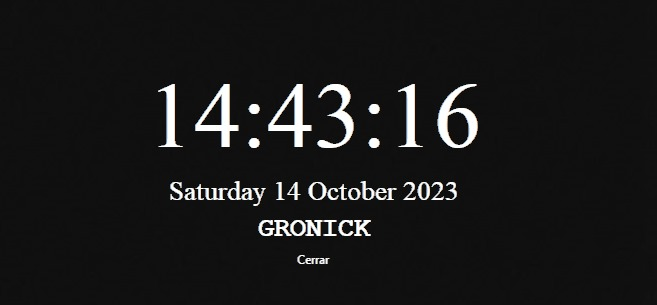

# Aplicación de Reloj y Botón Cerrar en Tkinter

Este es un simple programa en Python utilizando la biblioteca Tkinter que muestra la hora actual y proporciona un botón para cerrar la aplicación. La aplicación tiene una ventana transparente sin bordes y permite arrastrar la ventana.

## Características

- Muestra la hora actual en un formato de 24 horas.
- Muestra la fecha actual.
- Permite mover la ventana arrastrándola con el botón izquierdo del mouse.
- Proporciona un botón "Cerrar" para salir de la aplicación.

## Requisitos

- Python 3.x
- Biblioteca Tkinter (incluida en la instalación estándar de Python)

## Uso

1. Ejecute el archivo `clock_app.py`.
2. La ventana de la aplicación se abrirá y mostrará la hora actual y la fecha.
3. Puede arrastrar la ventana haciendo clic y arrastrando en cualquier parte de la ventana.
4. Haga clic en el botón "Cerrar" para salir de la aplicación.

## Captura de Pantalla

## Contribuciones

Si deseas contribuir o mejorar esta aplicación, ¡siéntete libre de hacerlo! Puedes bifurcar el repositorio y enviar tus solicitudes de extracción.

## Licencia

Este proyecto está bajo la Licencia MIT. Consulta el archivo LICENSE para obtener más detalles.

---

Si tienes alguna pregunta o problema, no dudes en contactarme.
